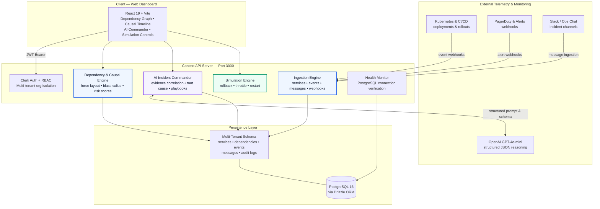

<div align="center">

# Context

**Your system already knows it's failing. Context explains why.**


</div>

---

## Tuesday, 2:14am

PagerDuty triggers on `checkout-service`: 504 Gateway Timeouts, error rate 28%, latency 4,200ms.

Within three minutes, six more alerts fire. `payment-v2` connection pool exhausted. `auth-session` redis latency spike. `order-processor` queue depth exceeding 10,000. `api-gateway` dropping 5% of ingress traffic.

Thirty engineers join the incident bridge. One team suspects AWS network degradation. Another investigates Stripe webhook delays. A third checks whether the midnight database migration locked a table. 

Every dashboard is red. Every metric confirms things are broken. And nobody knows what happened.

So you start where everyone starts: open Datadog in one tab, Grafana in another, Honeycomb in a third, and GitHub deployments in a fourth. Correlate timestamps by eye. Ask in Slack who deployed what. Trace network hops from memory. Forty minutes in, someone discovers an engineer pushed a configuration update to `inventory-db` at 2:08am that shrank the max pool size from 200 to 20.

The database didn't crash; it just queued. The queue slowed `inventory-service`, which timed out `cart-service`, which blocked `checkout-service`. 

The fix took thirty seconds: `kubectl rollout undo deployment/inventory-db`. The diagnosis took forty-four minutes and cost $68,000 in dropped transactions.

## The problem isn't missing telemetry

It's that there is too much of it, and zero causality between any of it.

Modern microservice architectures generate hundreds of thousands of signals per minute—traces, span events, Kubernetes pod logs, deployment webhooks, and Datadog alerts. Each subsystem faithfully records its own pain:

> `checkout-service`: "I am timing out."
> 
> `cart-service`: "I am waiting on inventory."
> 
> `inventory-service`: "I am waiting on DB connections."
> 
> `inventory-db`: "I was redeployed 6 minutes ago."

None of these alerts is false. But thirty alerts describing symptoms do not equal one explanation of cause. Every incident bridge becomes an ad-hoc investigation: six senior engineers, ten browser tabs, and forty minutes of human log correlation.

## Recording isn't understanding

Monitoring tools excel at recording *that* a metric crossed a threshold. They are silent on *why* it crossed it and *what* caused it to propagate.

The true operational cost of an incident was never the recovery command. A rollback takes seconds. The cost is everything that happens *before* the command—unraveling the cascade, determining which service was the patient zero, and proving causality while executive leadership asks for an ETA every three minutes.

That is the gap Context closes.

## So it explains itself

Context was built on one principle: **your architecture graph already contains the causal path, and the work is turning telemetry into an explainable diagnosis.**

When an anomaly begins, Context correlates live service dependencies with deployment history, error rates, and communication logs in real time:

1. **Topology-aware mapping**: Tracks directional dependencies between microservices, calculating upstream risk and downstream blast radius.
2. **Causal root-cause isolation**: Traces cascade paths back to the initiating trigger event (such as a bad deployment or config change) rather than superficial symptom alerts.
3. **Financial and blast-radius exposure**: Computes real-time revenue loss estimates and identifies healthy services at risk of imminent failure.
4. **Role-based intelligence**:
   - **Engineer**: Full technical breakdown, stack traces, and copyable `kubectl` remediation commands (`rollout undo`, `restart`, `throttle`).
   - **SRE**: Cascading blast radius, MTTR metrics, and simulated remediation actions.
   - **Manager**: Plain-English executive summaries, incident duration counters, and revenue impact metrics.

## The transformation

<table>
<tr><th width="50%">Before</th><th width="50%">With Context</th></tr>
<tr valign="top"><td>

*"Checkout is failing, payment is degraded, auth is slow, and thirty people are guessing in Slack."*

Fourteen alerts firing simultaneously. Engineers hunting through logs across four dashboards.

Forty minutes of correlation before finding the config change pushed six minutes prior.

Unknown revenue exposure. Post-mortem written days later from incomplete Slack history.

</td><td>

*"Root cause: inventory-db deployment at 02:08 caused pool exhaustion, cascading to checkout (94% confidence). Revenue at risk: $14,200/hr. Fix: rollback inventory-db."*

One unified causal graph. The true root cause isolated instantly at the top of the timeline.

One-click `kubectl rollout undo` ready to execute. Remediation simulated before applying.

Complete causal timeline and postmortem draft generated automatically.

</td></tr>
</table>

> **"You stop triaging noise and start resolving incidents."**

---

# How it works

The entire architecture operates under four governed principles:

> **Graphs map causality. AI correlates evidence. Simulators verify fixes. Engineers command.**

| Component | Responsibility | Mutates production? |
|---|---|:---:|
| **Dependency Engine** | Maps live topologies, evaluates cascade paths, calculates blast radius | No |
| **Telemetry Ingestion** | Ingests service events, deployment webhooks, and Slack logs | No |
| **AI Incident Commander** | Correlates evidence, diagnoses root causes, generates playbooks | **Never** |
| **Remediation Simulator** | Dry-runs rollbacks, restarts, and throttling before application | In simulation only |
| **Human Operator** | Reviews reasoning, verifies suggested fixes, executes remediation | **Authorizes** |

There is no path from the AI module to an autonomous unreviewed production mutation. The AI investigates, cites evidence, and proposes; the human engineer commands.

## Architecture



### One incident, start to finish

Every incident follows a deterministic causal pipeline:

```mermaid
flowchart LR
    A["Deploy / Alert<br/>webhook received"] --> B["Ingest & Scope<br/>by organizationId"]
    B --> C["Update Graph<br/>status & dependencies"]
    C --> D["Evaluate Risk<br/>blast radius & at-risk deps"]
    D --> E{"Incident<br/>detected?"}
    E -->|"No"| F["Healthy state maintained"]
    E -->|"Yes"| G["Activate Incident Banner<br/>live duration & revenue counter"]
    G --> H["AI Commander Analysis<br/>correlate logs + topology"]
    H --> I["Isolate Root Cause<br/>confidence score & cascade path"]
    I --> J["Generate Playbook<br/>Engineer • SRE • Manager views"]
    J --> K["Simulate Remediation<br/>test rollback or throttle"]
    K --> L["Operator Approval<br/>execute fix & verify recovery"]

    classDef alert fill:#FEF2F2,stroke:#DC2626,stroke-width:2px,color:#0F172A
    classDef success fill:#ECFDF5,stroke:#059669,stroke-width:2px,color:#0F172A
    classDef step fill:#F0F9FF,stroke:#0284C7,stroke-width:2px,color:#0F172A
    class A,G alert
    class F,L success
    class B,C,D,H,I,J,K step
```



---

## What's in the box

- **Force-directed dependency graph**: Interactive SVG visualization with zoom controls (50%–250%), pulsing animated edges on failure propagation, and real-time node health states.
- **Automated root cause isolation**: Analyzes topological directionality, failure timings, and deployment logs to flag root causes with numerical confidence scores.
- **Predictive cascade detection**: Evaluates healthy dependencies connected to failing services and warns operators before cascade failures trigger.
- **Live incident banner**: Real-time ticker displaying elapsed outage time, impacted service counts, and estimated revenue loss.
- **Role-based operational lenses**:
  - **Engineer view**: Technical logs, deployment diffs, and instant-copy `kubectl` remediation commands.
  - **SRE view**: Cascade path breakdown, MTTR metrics, blast radius, and simulation actions.
  - **Manager view**: Plain-English executive summaries and business impact figures with zero unnecessary technical noise.
- **Simulated remediation sandbox**: Safely triggers dry-run rollbacks, rate throttling, and container restarts to observe recovery behavior.
- **Interactive 9-step scenario demo**: Complete end-to-end incident playback running automatically without requiring third-party monitoring setups.
- **Multi-tenant isolation by design**: Strict tenant scoping across all services, events, and dependency queries to ensure cross-tenant data safety.
- **AudioWorklet voice streaming**: Real-time PCM16 audio streaming with `SequenceBuffer` gap recovery to prevent lockups on dropped SSE packets.

---

## Tech stack

| Layer | Technology | Purpose |
|---|---|---|
| **Frontend** | React 19, Vite 7, Tailwind CSS, Framer Motion | High-performance interactive dashboard and force graph |
| **Backend** | Express 5, TypeScript 5.9, Helmet, CORS | Secure, rate-limited REST API server |
| **Database** | PostgreSQL 16 + Drizzle ORM | Relational schema with cascade constraints and composite indexes |
| **Authentication** | Clerk (`@clerk/express`, `@clerk/react`) | Multi-tenant authentication, session management, and RBAC |
| **AI Engine** | OpenAI GPT-4o-mini via official SDK | Structured JSON schema analysis, root cause extraction, and Q&A |
| **Audio streaming** | AudioWorklet + PCM16 decode pipeline | Low-latency voice playback for Incident Commander sessions |
| **Testing** | Vitest 5 | Unit, security boundary, and integration testing |

---

## Quick start

### Prerequisites

- **Node.js**: Version 24+
- **pnpm**: Version 10+
- **PostgreSQL**: Running instance (local or hosted)

### Installation

```bash
git clone https://github.com/sudhanshukumar03/Context.git
cd Context
pnpm install
```

### Environment configuration

Create `.env` in `artifacts/api-server/.env` and `artifacts/context-app/.env`:

| Variable | Required | Purpose |
|---|:---:|---|
| `DATABASE_URL` | Yes | PostgreSQL connection URI |
| `SESSION_SECRET` | Yes | Secret string for session cookie signing |
| `CLERK_SECRET_KEY` | Optional in dev | Clerk backend secret key |
| `CLERK_PUBLISHABLE_KEY` | Optional in dev | Clerk frontend publishable key |
| `VITE_CLERK_PUBLISHABLE_KEY` | Optional in dev | Clerk key passed into the Vite dashboard |
| `OPENAI_API_KEY` | Optional in dev | OpenAI API key for AI Commander reasoning |
| `OPENAI_MODEL` | No | Defaults to `gpt-4o-mini` |
| `ALLOW_DEV_AUTH_BYPASS` | No | Set `true` to run offline without Clerk accounts |

> [!NOTE]
> Setting `ALLOW_DEV_AUTH_BYPASS=true` enables local development without internet access or third-party authentication credentials.

### Launching the platform

1. Build shared packages and verify type safety:
  ```bash
  pnpm run typecheck
  ```

2. Start the API server in terminal 1:
  ```bash
  pnpm --filter @workspace/api-server run dev
  ```

3. Start the web dashboard in terminal 2:
  ```bash
  pnpm --filter @workspace/context-app run dev
  ```

| Service | URL | Default Port |
|---|---|:---:|
| **Web Dashboard** | `http://localhost:5173` | `5173` |
| **API Server** | `http://localhost:3000/api` | `3000` |
| **Health Check** | `http://localhost:3000/healthz` | `3000` |

### Running the live demo

1. Open `http://localhost:5173`.
2. Click **▶ Run Demo** on the top navigation bar.
3. Watch the 9-step incident scenario unfold:
   - Baseline healthy state
   - `inventory-db` latency spike
   - Upstream connection pool exhaustion
   - Cascade failure reaching `checkout-service`
   - Real-time revenue loss ticker activation
   - AI root cause isolation (94% confidence)
   - Simulated rollback execution
   - Automated recovery and status verification

---

## API reference

Base path: `/api`. All endpoints except `/api/auth/*` and `/healthz` require Bearer authentication or an API key.

| Method | Endpoint | Description |
|---|---|---|
| `GET` | `/healthz` | Database connectivity health check (returns 200 or 503) |
| `POST` | `/api/upload/services` | Ingest microservices and directional dependency edges |
| `POST` | `/api/upload/events` | Ingest deployment, failure, and recovery events |
| `POST` | `/api/upload/messages` | Ingest operational messages and chat context |
| `POST` | `/api/webhook` | External webhook ingestion supporting `?apiKey=` query params |
| `GET` | `/api/insights/risks` | Retrieve at-risk services, risk scores, and recent events |
| `GET` | `/api/insights/root-cause` | Get root cause diagnosis, cascade path, and revenue loss |
| `GET` | `/api/insights/predictions` | Calculate failure probabilities for currently healthy services |
| `GET` | `/api/insights/graph` | Fetch dependency nodes and edges for visualization |
| `GET` | `/api/insights/timeline` | Retrieve chronological feed grouped by incident phases |
| `POST` | `/api/insights/simulate-action` | Dry-run `rollback`, `throttle`, or `restart` actions |
| `POST` | `/api/ai/incident-ask` | Query AI Incident Commander for root cause Q&A and playbooks |
| `POST` | `/api/demo/reset` | Clear services and events for the current organization |
| `POST` | `/api/demo/advance` | Step through the 9-stage incident simulation scenario |

### Contract invariants

1. **Multi-tenant scoping is mandatory**: `service_dependencies` has no separate `organizationId` column. All dependency queries must be filtered with `inArray(serviceDependencies.serviceId, orgServiceIds)` to prevent cross-tenant edge leakage.
2. **Atomic token rotation**: Refresh tokens rotate atomically using conditional updates to prevent concurrent reuse.
3. **Resilient AI parsing**: Model output is parsed using regex JSON extractors to prevent crashes from conversational preambles.

---

## Project structure

```text
.
├── artifacts/
│   ├── api-server/                 # Express 5 REST API server
│   │   ├── src/routes/             # Auth, insights, root-cause, upload, demo
│   │   ├── src/middleware/         # Clerk auth, multi-tenant scoping, error handling
│   │   └── src/services/           # AI service and causal analysis logic
│   ├── context-app/                # React 19 + Vite dashboard
│   │   ├── src/features/graph/     # Force-directed SVG dependency graph
│   │   ├── src/features/timeline/  # Incident phase timeline feed
│   │   ├── src/features/commander/ # AI chat and playbook execution
│   │   └── src/features/demo/      # 9-step incident simulation runner
│   ├── context-demo-video/         # Animated product walkthrough app
│   └── mockup-sandbox/             # Component preview environment
├── lib/
│   ├── api-client-react/           # Generated TanStack Query client hooks
│   ├── api-spec/                   # OpenAPI 3.0 specification contracts
│   ├── api-zod/                    # Shared Zod schemas for payload validation
│   ├── db/                         # PostgreSQL tables, relations, and connection pool
│   ├── integrations-openai-ai-react/  # AudioWorklet streaming and playback hooks
│   └── integrations-openai-ai-server/ # Server-side OpenAI client wrappers
└── scripts/                        # Repository build and validation scripts
```

---

## Testing

```bash
pnpm test            # Run Vitest test suite across all packages
pnpm run typecheck   # Validate TypeScript types across all 5 workspace projects
```

Three critical test suites guard system stability:
- **Multi-tenant security isolation**: Confirms cross-tenant mutations in `/api/insights/simulate-action` and unscoped dependency queries return 404/403.
- **Sequence buffer audio recovery**: Verifies packet reordering and automatic gap recovery when streaming audio chunks drop.
- **Atomic token rotation**: Guarantees concurrent token refresh requests cannot produce duplicate sessions.

---

## Decisions worth defending

**Why force-directed dependency graphs instead of dashboard tables?**
During an incident, tables sort alphabetically or by alarm time, completely obscuring the sequence of propagation. A directional graph immediately highlights the single node with outgoing failure arrows, making patient zero obvious in seconds.

**Why can't the AI automatically execute remediation commands in production?**
Language models hallucinate under edge cases. Having an AI autonomously run `kubectl rollout undo` on the wrong cluster or delete a pod during a stateful migration is catastrophic. Context adopts a strict boundary: **AI investigates and explains; human engineers command and authorize.**

**Why composite unique indexes on dependency edges?**
In high-throughput environments where CI/CD pipelines report service topology via webhooks, duplicate edges accumulate rapidly if not constrained at the database level. Composite unique constraints on `(service_id, depends_on_id)` guarantee clean graphs and idempotent ingestion.

**Why custom AudioWorklet hooks instead of standard HTML5 audio?**
Standard `<audio>` elements suffer from buffer underruns, lack low-latency PCM16 streaming, and cannot easily reassemble out-of-order SSE audio packets. The custom `SequenceBuffer` and worklet processor ensure glitch-free audio even under erratic network conditions.

---

## Why this matters

Distributed systems generate exponentially more noise than humans can process under pressure. Every microservice added to an architecture is another alert source, another log stream, and another opportunity for a cascade failure to disguise itself as ten unrelated bugs.

The goal of Context is not to replace the engineer on call. It is to eliminate the forty minutes of panicked log-diving, Slack firefighting, and metric correlation—giving responders the causality, context, and confidence they need to fix the system in seconds.

**Graphs map causality. AI correlates evidence. Simulators verify fixes. Engineers command.**

---

## License

MIT © Context Team. See [LICENSE](LICENSE) for details.